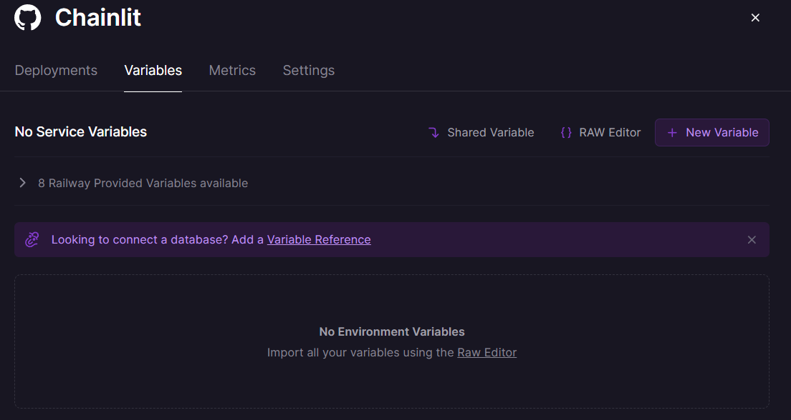

# Chainlit in Railway 👋

## Overview

[Chainlit](https://github.com/Chainlit/chainlit) is an open-source async Python framework which allows developers to build scalable Conversational AI or agentic applications.

- ✅ ChatGPT-like application
- ✅ Embedded Chatbot & Software Copilot
- ✅ Custom frontend (build your own agentic experience)
- ✅ API Endpoint

## Deploy

For a step-by-step guide to deploying on [Railway](https://railway.app/template/atS4DW?referralCode=jk_FgY), see [our deployment guide](https://github.com/Chainlit/chainlit/wiki/Deployment) for detailed instructions.

## Environment Variables

The following environment variables are required/supported:

### Required API Keys

- `OPENAI_API_KEY`: Your OpenAI API key (required when using OpenAI models)
- `GOOGLE_API_KEY`: Your Google API key (required when using Gemini models)
- `ANTHROPIC_API_KEY`: Your Anthropic API key (required when using Claude models)

### Model Configuration

- `LLM_MODEL`: The model to use (default: gpt-3.5-turbo). Supported models:
  - OpenAI models: gpt-3.5-turbo, gpt-4, etc.
  - Gemini models: gemini-pro, gemini-1.0-pro, etc.
  - Anthropic models: claude-3-opus, claude-3-sonnet, claude-2, etc.
- `LLM_TEMPERATURE`: Temperature setting for model responses (default: 0.7)
- `LLM_MAX_TOKENS`: Maximum tokens for model responses (default: 2000)

### Provider-specific Configuration

- `OPENAI_ORGANIZATION`: OpenAI organization ID for enterprise users

Add these variables in the Railway deployment console when deploying the app:

